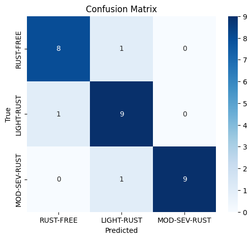

## 🛠️ Rust Classification

Rust Classification is a deep learning project that detects and classifies different levels of rust on metal surfaces.
The model is built using EfficientNet-based CNN architecture, fine-tuned on a custom dataset to distinguish between:

Rust-Free

Light Rust

Moderate–Severe Rust

The goal is to provide a reliable computer vision system that can support industrial inspection and maintenance applications, helping to automate rust detection and reduce manual labor.

## 🚀 Training the Rust Classifier

To train the model on your dataset, run:

```python
from tensorflow.keras.preprocessing.image import ImageDataGenerator
from tensorflow.keras.applications import EfficientNetB0
from tensorflow.keras.models import Model
from tensorflow.keras.layers import Dense, GlobalAveragePooling2D, Dropout
from tensorflow.keras.optimizers import Adam

# Dataset paths
train_dir = "dataset/train"
val_dir   = "dataset/val"

# Preprocessing
train_datagen = ImageDataGenerator(rescale=1./255)
val_datagen = ImageDataGenerator(rescale=1./255)

train_generator = train_datagen.flow_from_directory(
    train_dir, target_size=(224,224), batch_size=32, class_mode="categorical"
)
val_generator = val_datagen.flow_from_directory(
    val_dir, target_size=(224,224), batch_size=32, class_mode="categorical"
)

# Model
base_model = EfficientNetB0(include_top=False, weights="imagenet", input_shape=(224,224,3))
base_model.trainable = False

x = base_model.output
x = GlobalAveragePooling2D()(x)
x = Dropout(0.3)(x)
output = Dense(3, activation="softmax")(x)

model = Model(inputs=base_model.input, outputs=output)
model.compile(optimizer=Adam(1e-4), loss="categorical_crossentropy", metrics=["accuracy"])

# Training
history = model.fit(train_generator, validation_data=val_generator, epochs=15)
```

## 📂 Dataset Structure
```sql
dataset/
  train/
    RUST-FREE/
    LIGHT-RUST/
    MOD-SEV-RUST/
  val/
    RUST-FREE/
    LIGHT-RUST/
    MOD-SEV-RUST/
```
## ⚙️ Features

✅ Classifies images into Rust-Free, Light Rust, Moderate–Severe Rust

✅ EfficientNet backbone for lightweight deployment

✅ Transfer Learning + Fine-Tuning from ImageNet weights

✅ Data Augmentation (resize, normalization, flips, rotations)

✅ Training + Evaluation with accuracy, precision, recall, F1-score

✅ Visualization of preprocessing and predictions

## 📊 Results  

Final Test Set (30 images, 10 per class):  

| Class | Precision | Recall | F1-Score | Support |
|-------|-----------|--------|----------|---------|
| 0 (Rust-Free)       | 1.00 | 0.90 | 0.95 | 10 |
| 1 (Light Rust)      | 0.91 | 1.00 | 0.95 | 10 |
| 2 (Mod-Sev Rust)    | 1.00 | 1.00 | 1.00 | 10 |

**Overall Accuracy:** 97%  
**Macro Avg:** Precision 0.97 • Recall 0.97 • F1-Score 0.97  
**Weighted Avg:** Precision 0.97 • Recall 0.97 • F1-Score 0.97  



